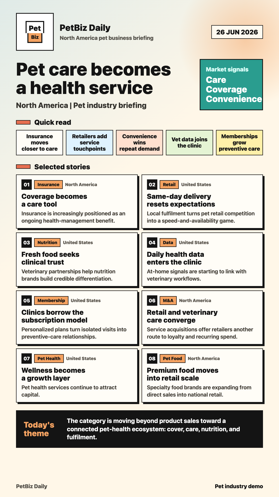
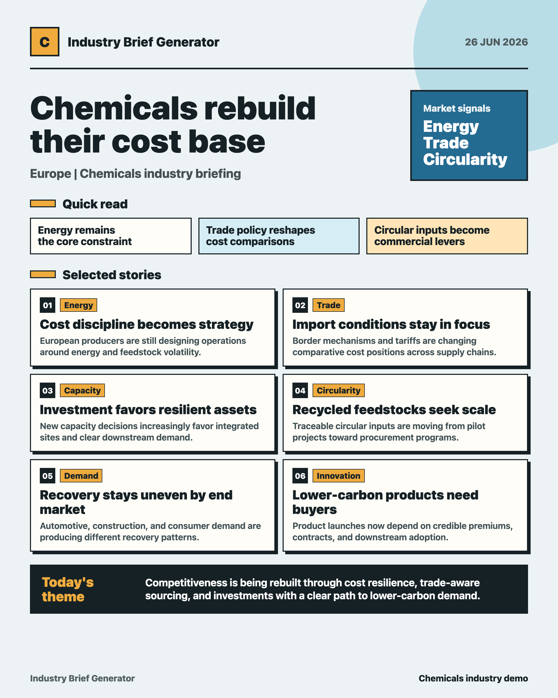
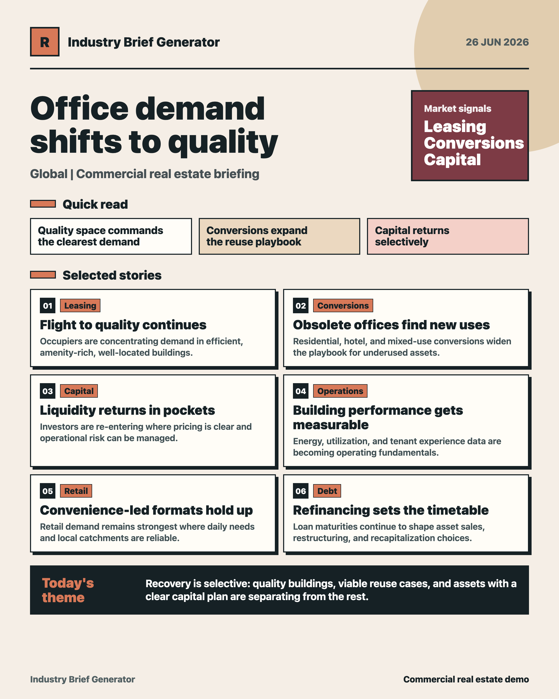

# Industry Brief Generator Skill

A Codex Skill for creating candidate-first industry briefings from current overseas market sources.

Chinese edition: [industry-brief-generator-skill-zh](https://github.com/vchenchen/industry-brief-generator-skill-zh)

The workflow separates research from publishing: Codex first produces a sourced candidate pool, waits for the user to select the final items, and only then creates the final brief, poster, and channel copy.

## What It Does

- Takes an industry, target market, focus topics, exclusions, and final use case
- Searches current overseas industry news, trade shows, product launches, M&A, policy updates, and trends
- Produces a candidate pool before any final output
- Waits for the user to select the final items
- Generates internal briefs, customer updates, newsletter copy, social copy, or poster-style summaries
- Refuses to fabricate sources, dates, company actions, or links
- Includes poster QA rules for text overflow, awkward line breaks, and crowded footer layouts

## Why Candidate-First

The biggest risk in daily industry briefings is not formatting. It is weak topic selection. This skill keeps research and publishing separate so a human can choose the final stories before Codex generates the final assets.

It is useful for:

- market intelligence briefings
- overseas industry news tracking
- distributor and agency opportunity scans
- internal strategy updates
- newsletter, social, and customer-facing content workflows

## Demo Posters

### Pet Industry



### Chemicals



### Commercial Real Estate



## Install

This repository uses the Codex repository-scope skill layout:

```text
.agents/skills/industry-brief-generator-en/
```

Clone this repository and start Codex from the repository root. Codex should detect the skill automatically.

You can also copy the skill into another project:

```text
your-project/.agents/skills/industry-brief-generator-en/
```

If the skill does not appear, restart Codex.

## Quick Start

```text
Use $industry-brief-generator-en.

Industry: office supplies
Target market: global
Focus topics: industry news, trade shows, new products, distributor and agency opportunities
Excluded content: social media posts and corporate soft copy
Final use: internal company brief
```

## Usage

Explicit invocation:

```text
Use $industry-brief-generator-en to create a candidate-first overseas industry brief.
```

Recommended input format:

```text
Industry:
Target market, such as North America, Europe, APAC, or global:
Focus topics, such as M&A, pricing, supply and demand, capacity expansion, policy, trade shows, or new products:
Excluded content, such as generic finance, social media posts, or corporate soft copy:
Final use, such as internal brief, newsletter, customer update, or social post:
```

Example:

```text
Use $industry-brief-generator-en.

Industry: office supplies
Target market: global
Focus topics: industry news, trade shows, new products, distributor and agency opportunities
Excluded content: social media posts and corporate soft copy
Final use: internal company brief
```

## Workflow

1. Read or create an industry config.
2. Search current sources and generate a candidate pool first.
3. Wait for the user to choose the required number of item numbers.
4. Generate the final brief and poster only after selection.
5. Visually inspect the poster before delivery.

The skill intentionally blocks final output until the user selects the final items.

## Included Example Configs

The skill includes sample YAML configs for:

- fitness
- chemicals
- pet industry
- hotels
- commercial real estate
- office supplies

You can adapt these configs for any industry.

## Release Notes

See [CHANGELOG.md](CHANGELOG.md).

## Good For

- Market research teams
- Consulting teams
- Industry media operators
- International business development
- Content teams
- Internal strategy briefings
- Export, distribution, and agency teams

## Trust Rules

The skill should not:

- fabricate sources, dates, companies, or links
- turn self-media posts into industry facts
- include weakly related financial news just to fill the list
- generate final posters before the user selects final items

If public information is insufficient, it should stop and ask for better sources, company names, narrower industry boundaries, or permission to use older background materials.

## Repository Structure

```text
.agents/skills/industry-brief-generator-en/
├── SKILL.md
├── agents/openai.yaml
├── references/
└── assets/configs/
```

## Notes

The original workflow was designed for Chinese-language industry briefings, but the skill instructions are written in English so teams can adapt the output language to their own audience.

## License

MIT
